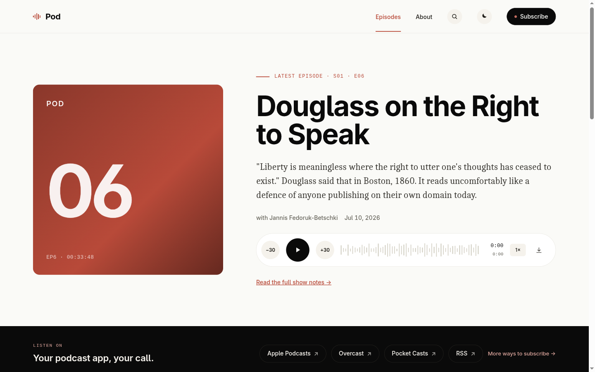
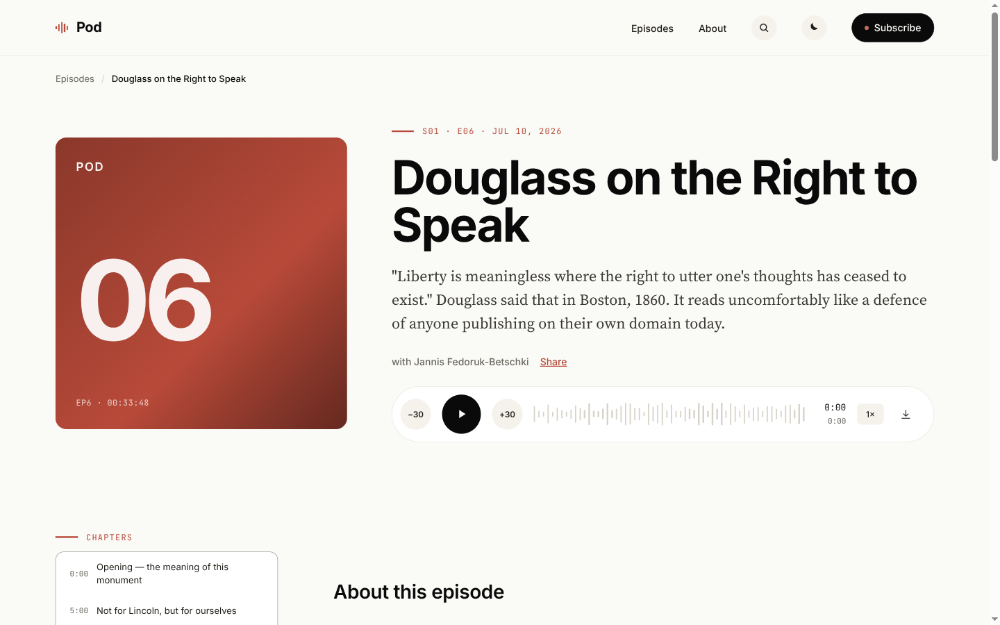
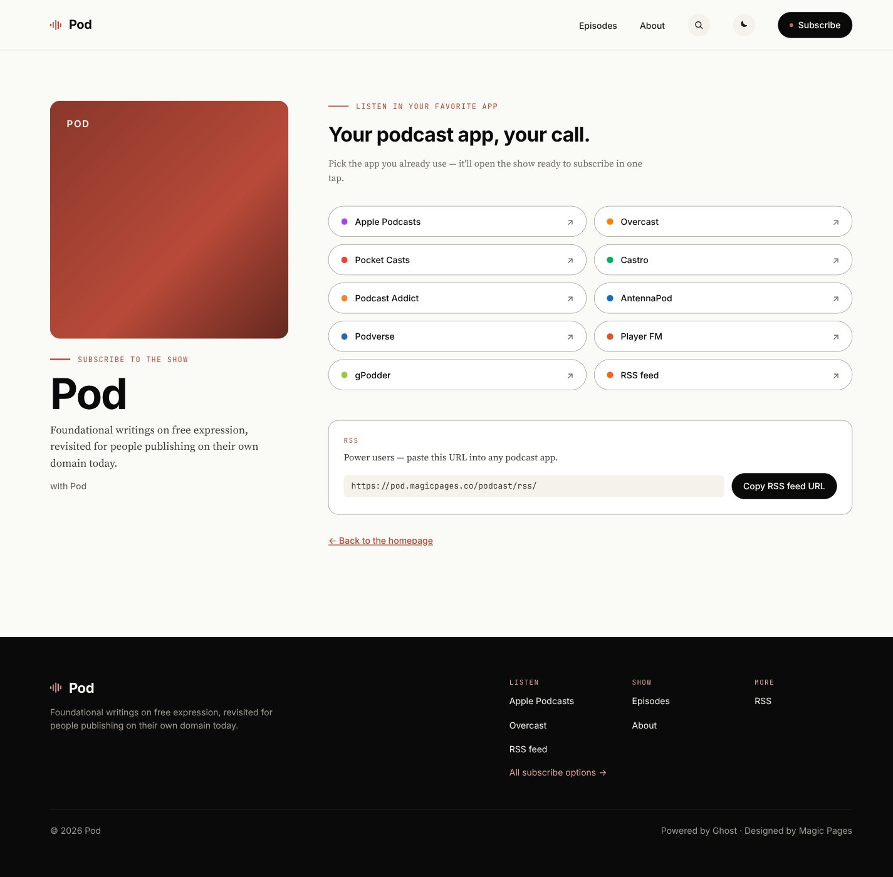

# Pod

A Ghost theme for podcasters. Made by [Magic Pages](https://www.magicpages.co).

**Live demo →** [pod.magicpages.co](https://pod.magicpages.co)



Pod turns your Ghost site into a full podcast home: a hero episode with a
built-in audio player, an iTunes-spec RSS feed, and a `/subscribe/` landing
page that meets your listeners in whichever app they use.

**No separate podcast host required.** The point of Pod is that your Ghost
site *is* the podcast host. Upload your MP3s to Ghost like any other file,
add a few `pod:*` markers in the episode's code-injection foot, and the
theme emits a full iTunes + Podcasting 2.0 RSS feed at `/podcast/rss/`.
Submit that URL to Apple Podcasts, Spotify for Podcasters, Overcast, and
the rest — they read your feed straight from your domain. One site, one
subscription, one place your audience talks to you.

<table>
  <tr>
    <td width="50%"></td>
    <td width="50%"></td>
  </tr>
  <tr>
    <td><em>Episode page — sticky player, chapter list, show notes</em></td>
    <td><em>/subscribe/ — 16 podcast apps, deep-linked</em></td>
  </tr>
</table>

- **11-15 podcast apps** — Apple Podcasts, Spotify, Overcast, Pocket Casts,
  Castro, Castbox, Podcast Addict, AntennaPod, Podverse, Player FM, gPodder,
  Amazon Music, YouTube Music, RSS. Each one uses the deepest possible link
  — custom URL schemes where they exist, publisher-provided show URLs for
  closed catalogs.
- **Podcast-native RSS** — iTunes-spec feed with per-episode audio,
  duration, episode / season / type, and Podlove Simple Chapters. Passes
  Apple Podcasts and Spotify validators.
- **Editorial cover art** — self-hosted typography (Inter + Source Serif Pro
  + JetBrains Mono), light / dark / system color scheme, driven by your
  Ghost accent color.
- **Full Ghost feature parity** — comments, member portal, tiers, prev / next
  episode navigation, tags, authors, recommendations, newsletter signup.
- **Localised** — English, German, French, Spanish, Ukrainian, Italian.

## Install

1. Download the latest `pod.zip` from the [releases page](https://github.com/magicpages/pod/releases).
2. In your Ghost admin: **Settings → Design → Change theme → Upload theme →**
   select the zip.
3. Activate Pod.

That's the theme itself. To turn on the podcast pieces, you'll also want to:

- Set the **podcast custom settings** (Design → Site-wide → Homepage): iTunes
  author, owner name/email, category, explicit flag, type. These populate the
  RSS feed's channel metadata.
- Install the bundled **`routes.yaml`** (Settings → Labs → Upload routes) so
  that `/podcast/rss/` and `/subscribe/` resolve. The file at
  [`routes.yaml`](./routes.yaml) is Ghost's default routes file plus the two
  entries Pod needs — upload it as-is on a fresh site. If you've already
  customised your routes, merge the two `routes:` entries from this file
  into yours instead of replacing it.
- Tag your podcast posts with the internal `#podcast` tag. That's the filter
  the RSS feed and archive templates read from.

**Cover art**. Pod ships a default 3000×3000 cover at
`assets/img/default-cover.jpg` (~360 KB, well under Apple's 512 KB
recommendation). It's used whenever an episode has no `feature_image`,
or when the site cover is still Ghost's default placeholder — so a
freshly-installed Pod site produces a valid iTunes feed on day one.
Replace the file (keep the same path and dimensions) to ship your own
default cover with the theme.

Each episode post uses **Code injection → foot** for the metadata that
doesn't fit in Ghost's UI:

```html
<!-- pod:audio=https://…/episode.mp3 -->    (optional; defaults to first <audio> in the post)
<!-- pod:audioLength=21524816 -->           (audio file size in bytes — improves player accuracy)
<!-- pod:duration=01:23:45 -->
<!-- pod:episode=12 -->
<!-- pod:season=1 -->
<!-- pod:explicit=false -->
<!-- pod:episodeType=full -->               (full | trailer | bonus)
<!-- pod:chapter=00:03:42|Chapter title --> (repeatable; rendered as PSC chapters)
```

**Podcasting 2.0** (the [podcastindex.org namespace](https://podcasting2.org))
adds these:

```html
<!-- pod:chapters=https://.../chapters.json -->     (PC2.0 chapters JSON URL)
<!-- pod:transcript=https://.../ep.vtt|text/vtt -->  (repeatable; add |en for language)
<!-- pod:person=Alice Smith|host|https://alice.example|https://.../alice.jpg -->
                                                     (repeatable; role/href/img optional)
<!-- pod:socialinteract=https://mastodon.example/@you/12345 -->
                                                     (fediverse comment root; add |activitypub|@you@host)
```

Channel-level Podcasting 2.0 tags (`<podcast:guid>`, `<podcast:locked>`,
`<podcast:funding>`, `<podcast:value>`) are configured in **Design →
Site-wide** — see the settings table below.

## Configuration

All settings live in **Ghost admin → Design → Site-wide** once Pod is active.

| Setting                     | What it does                                          |
|-----------------------------|-------------------------------------------------------|
| `color_scheme_default`      | Default color scheme for new visitors (Light / Dark / System). |
| `itunes_author` / `itunes_owner_name` / `itunes_owner_email` | Show owner metadata written to the RSS feed. Required for Apple Podcasts submission. |
| `itunes_category`           | Primary Apple Podcasts category. |
| `itunes_explicit`           | Channel-level explicit flag (per-episode override via `pod:explicit=`). |
| `itunes_type`               | `episodic` (latest first) or `serial` (oldest first). |
| `subscribe_apple_url`       | Apple Podcasts show URL. Empty falls back to the `podcast://` URL scheme, which only works on iOS/macOS. Set this to your `podcasts.apple.com/…` URL after Apple approves your feed. |
| `subscribe_spotify_url`     | Spotify show URL — required for the Spotify pill to appear. |
| `subscribe_amazon_url`      | Amazon Music show URL. |
| `subscribe_youtube_url`     | YouTube Music show URL. |
| `subscribe_castbox_url`     | Castbox channel URL. |
| `podcast_guid`              | Podcasting 2.0 `<podcast:guid>` — a UUIDv5 derived from the feed URL. Generate at [podcastindex.org/namespace/1.0#guid](https://podcastindex.org/namespace/1.0#guid). Persists across host changes. |
| `podcast_locked`            | `yes`/`no`. `yes` means other hosts should not import this feed. |
| `podcast_funding_url`       | Where listeners can support the show. Leave empty to fall back to Ghost's built-in tipjar (Portal → Support) when donations are enabled in your Ghost admin. |
| `podcast_value_type`        | `lightning` enables Value 4 Value payments. `none` disables the tag. |
| `podcast_value_address`     | Lightning node pubkey. Required for the `<podcast:value>` tag. |
| `show_post_cta`             | Whether to render the "Keep Listening" CTA card at the end of each episode. |
| `post_cta_heading`          | Heading for the CTA card. |

Apple Podcasts, Overcast, Pocket Casts, Castro, Podcast Addict, AntennaPod,
Podverse, Player FM and gPodder don't need any setting — Pod generates the
deep-link URL from your RSS feed and show title automatically. Only the
closed-catalog platforms above require a show URL.

## Development

Pod is a plain Ghost theme — any local Ghost install will work.

**Option A: Ghost's local dev**

```bash
npm install -g ghost-cli
cd path/to/local-ghost
ghost install local
```

Then clone Pod into `content/themes/pod` (or symlink), activate it in the
Ghost admin, and use the build commands below from the Pod directory.

**Option B: Ghost via Docker**

Any Ghost 5.93+ container will do. Bind-mount the theme into
`/var/lib/ghost/content/themes/pod` and activate it in the admin.

### Build commands

```bash
npm install                 # install build dependencies
npm run dev                 # Vite in watch mode — rebuild on change
npm run build               # one-off production build
npm run validate            # gscan against Ghost 6.x
npm run zip                 # package pod.zip for release
```

Template changes are picked up on the next request (Ghost re-reads `.hbs`
files each render). Asset changes (`assets/css/*`, `assets/js/*`) require
`npm run dev` or `npm run build` to regenerate `assets/built/`.

## Structure

```
pod/
├── assets/
│   ├── css/main.css        # Tailwind entry
│   ├── js/main.js          # Player + color-scheme + Pod meta hydration
│   ├── fonts/              # Self-hosted woff2 sources
│   ├── img/default-cover.jpg  # Shipped RSS artwork fallback (3000×3000)
│   └── built/              # Vite output (gitignored — built by npm run build)
├── locales/
│   ├── en.json + de/fr/es/uk/it.json
├── partials/               # Reusable Handlebars partials
│   ├── audio-player.hbs
│   ├── cover-art.hbs
│   ├── header.hbs / footer.hbs / navigation.hbs
│   ├── subscribe-band.hbs  # Home / archive band
│   ├── subscribe-pills.hbs # Top-5 pills + more-link (shared by band & CTA)
│   └── subscribe-grid.hbs  # Full 10–16 platform grid on /subscribe/
├── podcast/
│   └── rss.hbs             # iTunes-spec podcast feed
├── subscribe.hbs           # /subscribe/ landing page
├── default.hbs / index.hbs / post.hbs / page.hbs
├── tag.hbs / author.hbs / error*.hbs
├── routes.yaml             # Ghost default routes + /podcast/rss/ + /subscribe/
├── tailwind.config.js / postcss.config.js / vite.config.js
├── package.json            # Theme metadata + custom settings + build scripts
├── CHANGELOG.md
├── CONTRIBUTING.md
└── LICENSE
```

## Contributing

See [CONTRIBUTING.md](./CONTRIBUTING.md).

## License

Pod is [MIT-licensed](./LICENSE).

Third-party assets — the self-hosted fonts (Inter, Source Serif Pro,
JetBrains Mono) — ship under their own licenses. See
[`THIRD-PARTY-NOTICES.md`](./THIRD-PARTY-NOTICES.md) for the required
attribution and [`licenses/OFL-1.1.txt`](./licenses/OFL-1.1.txt) for the
SIL Open Font License text.

Ghost® is a registered trademark of the Ghost Foundation. This theme is not
affiliated with or endorsed by the Ghost Foundation.
